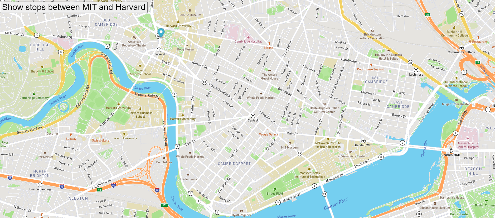

# Real Time Bus Tracker
## Map for tracking stops between MIT and Harvard

When button "Show Stops Between MIT and Harvard" is pressed you will see the map marker move to show the bus stop between MIT's campus and Harvard University. The map marker stops at each bus stop along the way. The projects uses Mapbox and geographical coordinates to assist in the visual movement along the bus stop route.

## How To

Load the index.html web page. When you click the button "Show stops between MIT and Harvard" you can see the map marker move. Additional improvements include marking the route back from Harvard to MIT. Additionally, adding the ability to click on each marker as it moves to get more specific information about each bus stop would be an improvement. 

